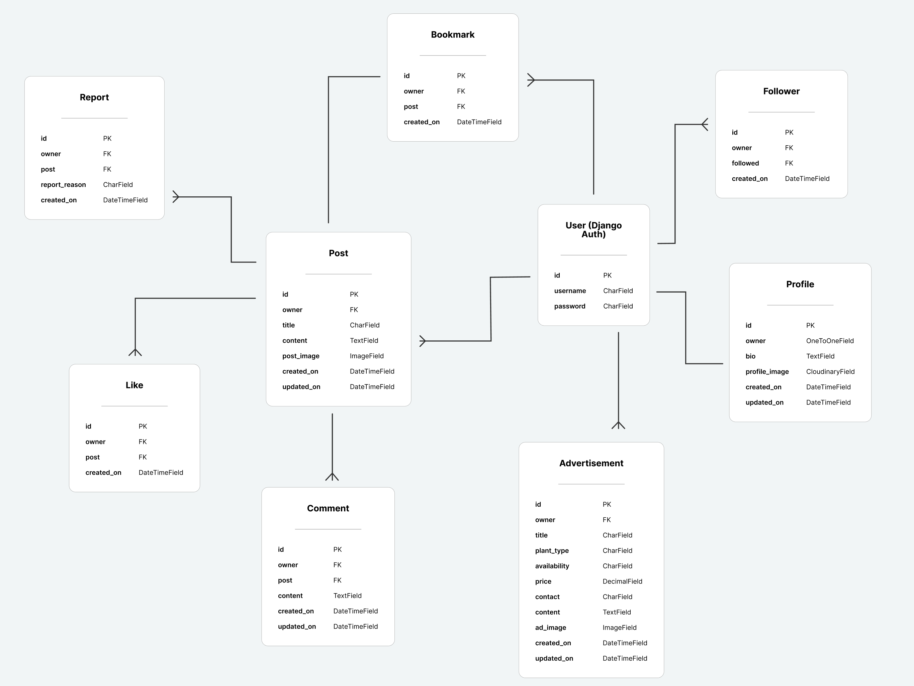

# PlantLife DRF API

The PlantLife DRF API is the backend solution for the PlantLife React App. 
The API is built upon Django while Cloudinary is used to host images.

[Link to the project](https://drf-api-plantlife-bdbe99797603.herokuapp.com/)

## Database

The database consists of 9 models. 
The User model is directly related to the Profile, Follower, Advertisement, Bookmark and Post model. Subsequently the Post model further passes down information to the Report, Like and Comment model.

## Testing

### Feature Testing

#### Deployed API
| Feature | Action | Expected Behaviour | Pass/Fail
| --- | --- | --- | --- |
| Profiles | Visit /profiles | List of all profiles | Pass
| Posts | Visit /posts | List of all posts | Pass
| Comments | Visit /comments | List of all comments | Pass
| Bookmarks | Visit /bookmarks | List of all bookmarks| Pass
| Reports | Visit /reports | List of all reports | Pass
| Likes | Visit /likes | List of all likes | Pass
| Followers | Visit /followers | List of all followers | Pass
| Advertisements | Visit /advertisements | List of all advertisements | Pass
| Admin | Visit /admin | See admin sign in screen | Pass
| Admin | Add wrong admin credentials| Error message that credentials must be correct | Pass
| Admin | Add correct credentials | Sign in to admin | Pass

#### Local API
| Feature | Action | Expected Behaviour | Pass/Fail
| --- | --- | --- | --- |
| Profiles | Visit /profiles | List of all profiles | Pass
| Profiles | Click on Filters | See list of available ordering and filter options | Pass
| Profiles | Click on any filter/ordering option | Only shows profile results based on selection | Pass
| Profile Detail | Visit /profiles/id/ | Shows user profile page | Pass
| Profile Detail | Change profile data and click submit button | Changes applied to user profile | Pass
| Posts | Visit /posts | List of all posts | Pass
| Posts | Click on Filters | See list of available ordering and filter options | Pass
| Posts | Click on any filter/ordering option | Only shows post results based on selection | Pass
| Posts | Submit new post without entering required field | Shows page with HTTP 400 Bad Request | Pass
| Posts | Submit new post including required field | Shows page with HTTP 201 Created | Pass
| Post Detail | Visit /posts/id/ | See post detail page | Pass
| Post Detail | Change and submit post | Updates post data | Pass
| Post Detail | Click Delete button | Opens warning modal | Pass
| Post Detail | Click Cancel on warning modal | Modal disappears | Pass
| Post Detail | Click Delete on warning modal | Shows page with HTTP 204 No Content | Pass
| Comments | Visit /comments | List of all comments | Pass
| Comments | Click on Filters | See list of available ordering and filter options | Pass
| Comments | Click on any filter/ordering option | Only shows comment results based on selection | Pass
| Comments | Submit new comment by selecting a post but without entering required field | Shows page with HTTP 400 Bad Request | Pass
| Comments | Submit new comment by selecting a post and filling in required field | Shows page with HTTP 201 Created | Pass
| Comment Detail | Visit /comments/id/ | See comment detail page | Pass
| Comment Detail | Change and submit comment | Updates comment data | Pass
| Comment Detail | Click Delete button | Opens warning modal | Pass
| Comment Detail | Click Cancel on warning modal | Modal disappears | Pass
| Comment Detail | Click Delete on warning modal | Shows page with HTTP 204 No Content | Pass
| Bookmarks | Visit /bookmarks | List of all bookmarked posts| Pass
| Bookmarks | Select post to be bookmarked | Shows page with HTTP 201 Created | Pass
| Bookmarks | Bookmark an already bookmarked post | Shows page with HTTP 400 Bad Request | Pass
| Bookmark Detail | Visit /bookmarks/id/ | See bookmark detail page | Pass
| Bookmark Detail | Click Delete button | Opens warning modal | Pass
| Bookmark Detail | Click Cancel on warning modal | Modal disappears | Pass
| Bookmark Detail | Click Delete on warning modal | Shows page with HTTP 204 No Content | Pass
| Reports | Visit /reports | List of all reported posts | Pass
| Reports | Select post and report reason and submit report | Shows page with HTTP 201 Created | Pass
| Reports | Report an already reported post | Shows page with HTTP 400 Bad Request | Pass
| Report Detail | Visit /reports/id/ | See report detail page | Pass
| Report Detail | Click Delete button | Opens warning modal | Pass
| Report Detail | Click Cancel on warning modal | Modal disappears | Pass
| Report Detail | Click Delete on warning modal | Shows page with HTTP 204 No Content | Pass
| Likes | Visit /likes | List of all liked posts | Pass
| Likes | Select post and click submit button | Shows page with HTTP 201 Created | Pass
| Likes | Like an already liked post | Shows page with HTTP 400 Bad Request | Pass
| Like Detail | Visit /likes/id/ | See like detail page | Pass
| Like Detail | Click Delete button | Opens warning modal | Pass
| Like Detail | Click Cancel on warning modal | Modal disappears | Pass
| Like Detail | Click Delete on warning modal | Shows page with HTTP 204 No Content | Pass
| Followers | Visit /followers | List of all profiles with followers | Pass
| Followers | Select profile and click submit button | Shows page with HTTP 201 Created | Pass
| Followers | Follow an already followed post | Shows page with HTTP 400 Bad Request | Pass
| Follower Detail | Visit /followers/id/ | See follower detail page | Pass
| Follower Detail | Click Delete button | Opens warning modal | Pass
| Follower Detail | Click Cancel on warning modal | Modal disappears | Pass
| Follower Detail | Click Delete on warning modal | Shows page with HTTP 204 No Content | Pass
| Advertisements | Visit /advertisements | List of all advertisements | Pass
| Advertisements | Click on Filters | See list of available ordering and filter options | Pass
| Advertisements | Click on any filter/ordering option | Only shows post results based on selection | Pass
| Advertisements | Submit new advertisement without entering required field | Shows page with HTTP 400 Bad Request | Pass
| Advertisements | Submit new advertisement including required field | Shows page with HTTP 201 Created | Pass
| Advertisement Detail | Visit /advertisements/id/ | See advertisement detail page | Pass
| Advertisement Detail | Change and submit advertisement | Updates advertisement data | Pass
| Advertisement Detail | Click Delete button | Opens warning modal | Pass
| Advertisement Detail | Click Cancel on warning modal | Modal disappears | Pass
| Advertisement Detail | Click Delete on warning modal | Shows page with HTTP 204 No Content | Pass
| Admin | Visit /admin | See admin sign in screen | Pass
| Admin | Add wrong admin credentials| Error message that credentials must be correct | Pass
| Admin | Add correct credentials | Sign in to admin | Pass